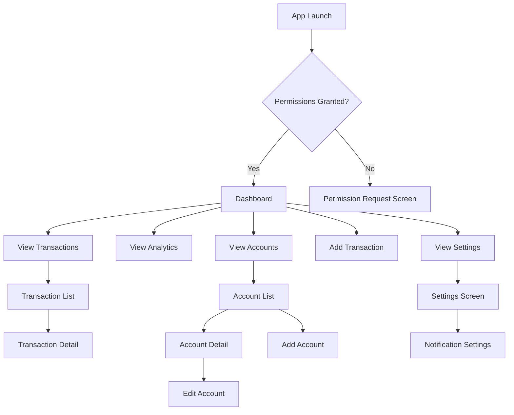

# Main User Flows

```mermaid
flowchart TD
    A[App Launch] --> B{Permissions Granted?}
    B -->|Yes| C[Dashboard]
    B -->|No| D[Permission Request Screen]

    C --> E[View Transactions]
    C --> F[View Analytics]
    C --> G[View Accounts]
    C --> H[Add Transaction]
    C --> I[View Settings]

    E --> J[Transaction List]
    J --> K[Transaction Detail]

    G --> L[Account List]
    L --> M[Account Detail]
    L --> N[Add Account]
    M --> O[Edit Account]

    I --> P[Settings Screen]
    P --> Q[Notification Settings]

```
