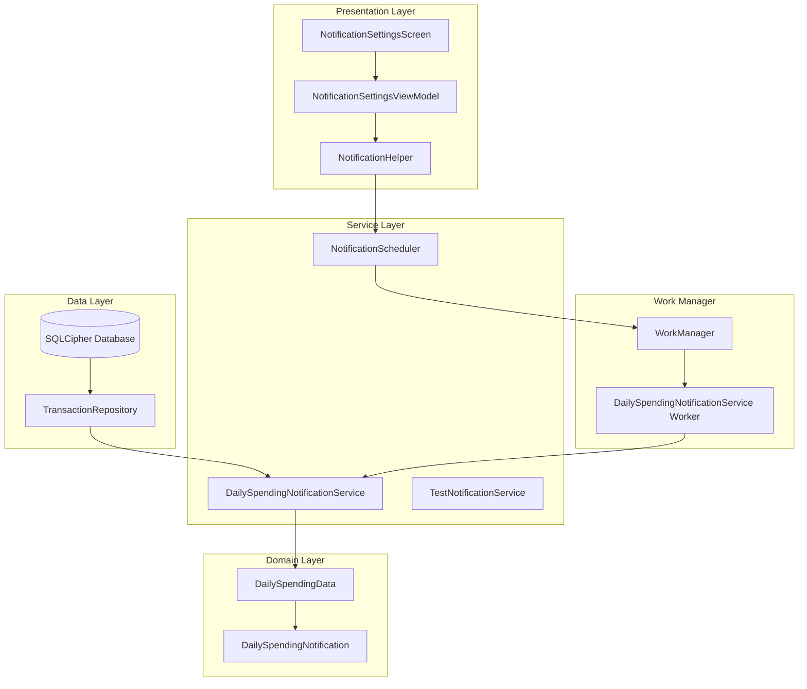

# Daily Spending Notification Feature

## 📱 Overview

The Daily Spending Notification feature provides users with automated daily summaries of their spending patterns, insights, and analytics through in-app notifications. This feature helps users stay informed about their financial habits without manually checking the app.

## 🏗️ Architecture

### Components



## 🔧 Implementation Details

### 1. Data Models

#### DailySpendingData
- **Purpose**: Core data structure for daily spending analytics
- **Location**: `domain/model/DailySpendingData.kt`
- **Key Fields**:
  - `totalSpent`: Total amount spent in the day
  - `totalIncome`: Total income received
  - `netAmount`: Net amount (income - spent)
  - `transactionCount`: Number of transactions
  - `topCategory`: Most spent category
  - `topMerchant`: Most frequent merchant
  - `spendingByCategory`: Category-wise breakdown

#### DailySpendingNotification
- **Purpose**: Notification-specific data with insights and comparisons
- **Key Features**:
  - Comparison with yesterday and last week
  - AI-generated insights
  - Spending pattern analysis
  - Budget alerts

### 2. Services

#### DailySpendingNotificationService
- **Type**: Hilt Worker
- **Purpose**: Generates and sends daily spending notifications
- **Features**:
  - Calculates daily spending metrics
  - Generates spending insights
  - Creates comparison data
  - Sends formatted notifications

#### NotificationScheduler
- **Type**: Hilt Worker
- **Purpose**: Schedules daily notifications
- **Features**:
  - Schedules notifications at 8 PM daily
  - Handles notification frequency settings
  - Manages recurring notifications

#### TestNotificationService
- **Type**: Singleton Service
- **Purpose**: Sends test notifications for debugging
- **Features**:
  - Simple test notification
  - Verification of notification system

### 3. UI Components

#### NotificationSettingsScreen
- **Purpose**: User interface for notification preferences
- **Features**:
  - Toggle daily notifications on/off
  - Set notification time
  - Choose notification frequency
  - Configure notification content
  - Test notification functionality

#### NotificationSettingsViewModel
- **Purpose**: Manages notification settings state
- **Features**:
  - Loads current settings
  - Updates notification preferences
  - Handles test notifications
  - Manages UI state

### 4. Utilities

#### NotificationHelper
- **Purpose**: Centralized notification management
- **Features**:
  - Creates notification channels
  - Manages notification preferences
  - Provides settings management
  - Handles notification permissions

## 🚀 Usage

### Enabling Daily Notifications

1. **Navigate to Settings**:
   ```
   Main App → Settings → Notifications
   ```

2. **Configure Settings**:
   - Toggle "Daily Spending Notifications" ON
   - Set preferred notification time (default: 8:00 PM)
   - Choose frequency (Daily/Weekly/Monthly)
   - Configure content preferences

3. **Test Notifications**:
   - Use "Send Test Notification" button
   - Verify notification appears in system tray

### Notification Content

#### Daily Summary
- Total amount spent
- Total income received
- Net amount (income - spent)
- Number of transactions
- Top spending category
- Top merchant

#### Insights
- Spending level analysis
- Savings rate calculation
- Transaction pattern insights
- Category-specific observations

#### Comparisons
- Yesterday vs today spending
- Last week vs this week spending
- Trend analysis

## ⚙️ Configuration

### Notification Channels

#### Daily Spending Channel
- **ID**: `daily_spending_channel`
- **Name**: "Daily Spending Analytics"
- **Description**: "Daily spending summary and analytics notifications"
- **Importance**: DEFAULT
- **Features**: Lights, Vibration, Badge

#### Test Notification Channel
- **ID**: `test_notification_channel`
- **Name**: "Test Notifications"
- **Description**: "Test notifications for development and debugging"
- **Importance**: DEFAULT

### WorkManager Configuration

```kotlin
// Application class implements Configuration.Provider
override fun getWorkManagerConfiguration(): Configuration {
    return Configuration.Builder()
        .setWorkerFactory(workerFactory)
        .build()
}
```

### Notification Scheduling

- **Initial Delay**: Calculated to next 8 PM
- **Recurring**: Daily at 8 PM
- **Constraints**: No network required, battery not low
- **Backoff Policy**: Exponential backoff for failures

## 🔒 Security & Privacy

### Data Protection
- All calculations performed locally
- No data sent to external services
- Secure logging with sensitive data redaction
- Encrypted database access

### Permissions
- `POST_NOTIFICATIONS`: Required for Android 13+
- No additional permissions required

## 🧪 Testing

### Test Notification
```kotlin
// Send test notification
testNotificationService.sendTestNotification()
```

### Manual Testing
1. Enable notifications in settings
2. Use "Send Test Notification" button
3. Verify notification appears
4. Check notification content and formatting

### Automated Testing
- Unit tests for data calculations
- Integration tests for notification scheduling
- UI tests for settings screen

## 📊 Analytics & Insights

### Generated Insights
1. **Spending Level**:
   - "No spending today! Great job saving money."
   - "Low spending day - you're being frugal!"
   - "High spending day - consider reviewing your expenses."

2. **Savings Rate**:
   - "Excellent savings rate of 75%!"
   - "Good savings rate of 25%"
   - "Spent more than earned today - consider budgeting"

3. **Transaction Patterns**:
   - "Busy day with 15 transactions"
   - "Single transaction day - very focused spending"

4. **Category Insights**:
   - "Most spent on: Food & Dining"
   - "Top merchant: Amazon"

5. **Comparisons**:
   - "Spent ₹500 more than yesterday"
   - "Spent ₹200 less than last week"

## 🛠️ Customization

### Adding New Insights
```kotlin
private fun generateInsights(
    totalSpent: BigDecimal,
    // ... other parameters
): List<String> {
    val insights = mutableListOf<String>()
    
    // Add custom insight logic
    if (totalSpent > customThreshold) {
        insights.add("Custom insight message")
    }
    
    return insights
}
```

### Modifying Notification Content
```kotlin
private fun buildNotificationContent(data: DailySpendingNotification): String {
    val content = StringBuilder()
    
    // Add custom content
    content.append("Custom metric: ${data.customField}\n")
    
    return content.toString()
}
```

### Changing Notification Time
```kotlin
// Update notification time preference
notificationHelper.setNotificationTimePreference("21:00") // 9 PM
```

## 🐛 Troubleshooting

### Common Issues

1. **Notifications Not Appearing**:
   - Check system notification permissions
   - Verify notification channels are created
   - Ensure WorkManager is properly configured

2. **Incorrect Data**:
   - Verify transaction data is properly loaded
   - Check date range calculations
   - Ensure proper timezone handling

3. **Scheduling Issues**:
   - Check WorkManager constraints
   - Verify notification time format
   - Ensure app is not in battery optimization

### Debug Logging
```kotlin
// Enable debug logging
secureLogger.d("DailySpendingNotification", "Debug message")
```

## 📈 Future Enhancements

### Planned Features
1. **Smart Notifications**: ML-based notification timing
2. **Budget Alerts**: Real-time spending limit notifications
3. **Weekly/Monthly Summaries**: Extended analytics
4. **Custom Insights**: User-defined insight rules
5. **Notification Templates**: Customizable notification formats

### Integration Opportunities
1. **Calendar Integration**: Schedule-based notifications
2. **Location Awareness**: Location-based spending insights
3. **Weather Integration**: Weather-based spending patterns
4. **Social Features**: Share spending achievements

## 📝 Code Examples

### Sending a Custom Notification
```kotlin
val notification = NotificationCompat.Builder(context, CHANNEL_ID)
    .setSmallIcon(R.drawable.ic_launcher_foreground)
    .setContentTitle("Custom Title")
    .setContentText("Custom content")
    .setStyle(NotificationCompat.BigTextStyle().bigText("Detailed content"))
    .setContentIntent(pendingIntent)
    .setAutoCancel(true)
    .build()

NotificationManagerCompat.from(context).notify(NOTIFICATION_ID, notification)
```

### Scheduling a One-time Notification
```kotlin
val workRequest = OneTimeWorkRequestBuilder<DailySpendingNotificationService>()
    .setConstraints(constraints)
    .setInitialDelay(delay, TimeUnit.MILLISECONDS)
    .build()

WorkManager.getInstance(context).enqueue(workRequest)
```

---

*This feature provides a comprehensive daily spending notification system that helps users stay informed about their financial habits through automated, insightful notifications.*
