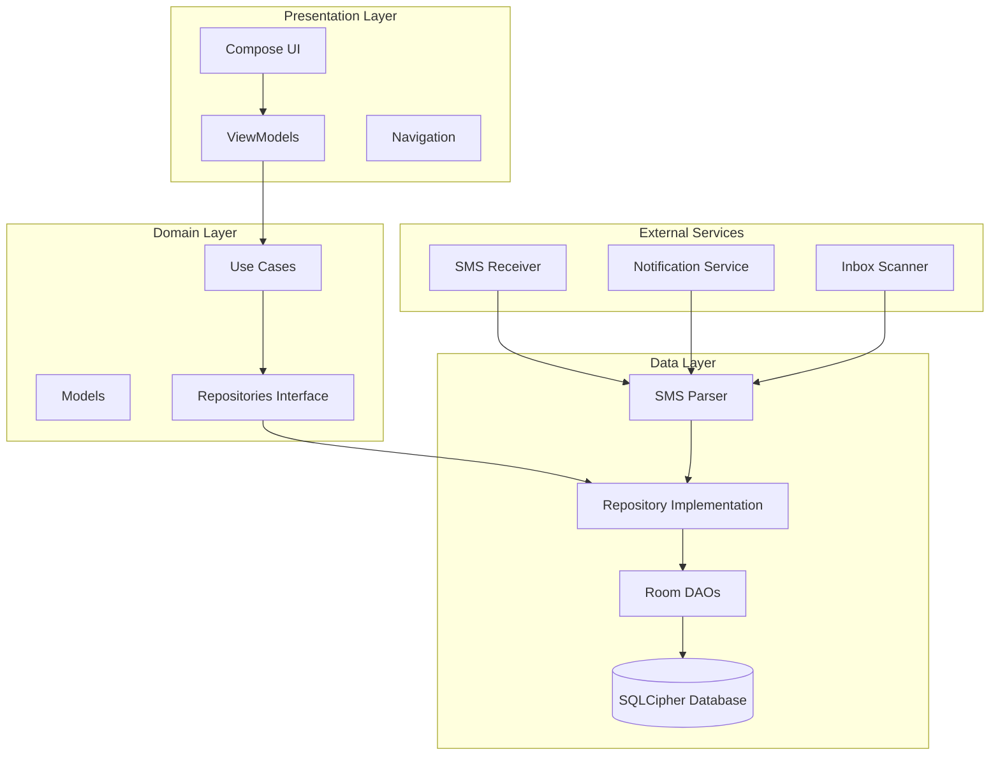
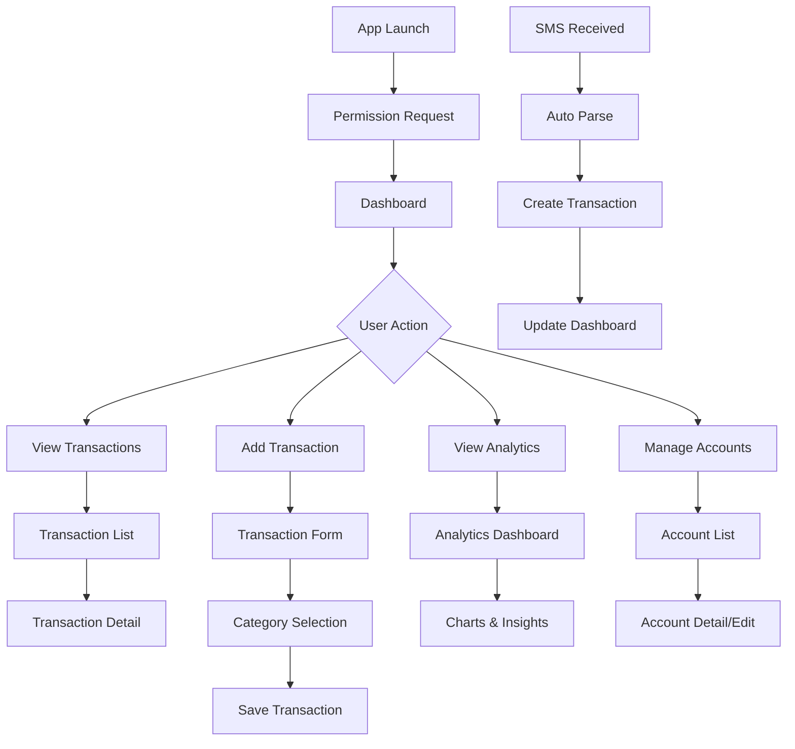

# FinTrack - Personal Finance Management App

## 📋 Executive Summary

FinTrack is a sophisticated Android personal finance management application that automatically tracks financial transactions through SMS parsing and provides comprehensive analytics. Built with modern Android development practices, it offers a secure, user-friendly platform for managing personal finances with minimal manual intervention.

## 🏗️ System Architecture

### High-Level Architecture

### Clean Architecture Implementation

The application follows Clean Architecture principles with clear separation of concerns:

- **Presentation Layer**: Jetpack Compose UI with MVVM pattern
- **Domain Layer**: Business logic and use cases
- **Data Layer**: Repository pattern with Room database
- **External Services**: SMS processing and background services

## 🔧 Technical Stack

### Core Technologies
- **Language**: Kotlin 2.0.21
- **UI Framework**: Jetpack Compose with Material 3
- **Architecture**: MVVM + Clean Architecture
- **Dependency Injection**: Hilt
- **Database**: Room with SQLCipher encryption
- **Navigation**: Navigation Compose
- **Charts**: Compose Charts library

### Security & Privacy
- **Database Encryption**: SQLCipher with AES-256
- **Key Management**: Android Keystore with encrypted preferences
- **Logging**: Secure logging with sensitive data redaction
- **Permissions**: Minimal required permissions

## 📱 Features & Capabilities

### Core Features
1. **Automatic Transaction Detection**
   - SMS-based transaction parsing
   - Support for major Indian banks (HDFC, ICICI, SBI, etc.)
   - UPI transaction recognition
   - Confidence-based filtering

2. **Account Management**
   - Multiple account support
   - Automatic account creation from SMS
   - Account categorization and tracking

3. **Transaction Management**
   - Manual transaction entry
   - Transaction categorization
   - Search and filtering capabilities
   - Transaction verification system

4. **Analytics & Insights**
   - Spending trends visualization
   - Category-wise breakdown
   - Monthly/weekly spending analysis
   - Merchant analysis

5. **Data Security**
   - End-to-end encryption
   - Local data storage only
   - Secure key management

## 🎯 User Experience Analysis

### User Journey Flow

### Usability Strengths
- **Minimal Setup**: Automatic transaction detection reduces manual entry
- **Intuitive Navigation**: Clear bottom navigation with logical flow
- **Visual Analytics**: Rich charts and visualizations for spending insights
- **Search & Filter**: Powerful transaction discovery capabilities
- **Responsive Design**: Material 3 design system for modern look

### Areas for Improvement
- **Onboarding**: Missing guided tour for new users
- **Offline Capabilities**: Limited offline functionality
- **Export Features**: No data export capabilities
- **Backup/Restore**: No cloud backup options

## 🔍 Code Quality Analysis

### Strengths
1. **Clean Architecture**: Well-structured with clear separation of concerns
2. **Modern Android Practices**: Uses latest Jetpack libraries and Compose
3. **Security-First Approach**: Comprehensive encryption and secure logging
4. **Testable Design**: Repository pattern enables easy unit testing
5. **Type Safety**: Strong typing with Kotlin and proper null safety

### Code Structure Quality
- **Modularity**: Good separation between presentation, domain, and data layers
- **Dependency Injection**: Proper use of Hilt for DI
- **Error Handling**: Comprehensive error handling with fallback mechanisms
- **Logging**: Structured logging with security considerations

### Areas for Improvement
1. **Code Duplication**: Some repetitive patterns in UI components
2. **Error Messages**: Generic error messages could be more user-friendly
3. **Testing Coverage**: Limited test files present
4. **Documentation**: Inline documentation could be more comprehensive

## 🚀 Scalability & Performance

### Current Scalability
- **Database**: Room with SQLCipher handles moderate transaction volumes well
- **Memory Management**: Proper use of Compose state management
- **Background Processing**: Efficient SMS processing with coroutines

### Performance Considerations
- **SMS Processing**: Async processing prevents UI blocking
- **Database Queries**: Optimized queries with proper indexing
- **UI Rendering**: Compose's efficient recomposition

### Scalability Limitations
- **Local Storage Only**: No cloud sync capabilities
- **Single Device**: No multi-device synchronization
- **Limited Analytics**: Basic analytics without advanced ML insights

## 📊 Business Value Proposition

### Target Market
- **Primary**: Tech-savvy individuals in India
- **Secondary**: Small business owners needing expense tracking
- **Tertiary**: Financial advisors and accountants

### Value Drivers
1. **Automation**: Reduces manual data entry by 90%
2. **Security**: Bank-grade encryption for sensitive financial data
3. **Insights**: Actionable spending analytics
4. **Simplicity**: Intuitive interface requiring minimal learning

### Competitive Advantages
- **SMS Integration**: Unique automatic transaction detection
- **Privacy-First**: Local data storage with no cloud dependency
- **Indian Market Focus**: Optimized for Indian banking SMS formats
- **Modern UI**: Contemporary design with Material 3

## 🛠️ Development Recommendations

### Immediate Improvements (High Priority)
1. **Add Comprehensive Testing**
   - Unit tests for business logic
   - UI tests for critical user flows
   - Integration tests for SMS parsing

2. **Enhance Error Handling**
   - User-friendly error messages
   - Retry mechanisms for failed operations
   - Offline mode indicators

3. **Improve Onboarding**
   - Welcome screens explaining features
   - Permission rationale explanations
   - Sample data for demonstration

### Medium-Term Enhancements
1. **Data Export/Import**
   - CSV export functionality
   - Data backup and restore
   - Migration tools

2. **Advanced Analytics**
   - Budget tracking and alerts
   - Spending predictions
   - Goal setting and tracking

3. **Performance Optimization**
   - Database query optimization
   - Image compression for receipts
   - Background sync improvements

### Long-Term Roadmap
1. **Cloud Integration**
   - Optional cloud backup
   - Multi-device synchronization
   - Web dashboard

2. **AI/ML Features**
   - Smart categorization improvements
   - Spending pattern recognition
   - Fraud detection

3. **Enterprise Features**
   - Multi-user support
   - Advanced reporting
   - API integration

## 🔒 Security Assessment

### Current Security Measures
- **Database Encryption**: SQLCipher with AES-256
- **Key Management**: Android Keystore integration
- **Secure Logging**: Sensitive data redaction
- **Permission Management**: Minimal required permissions

### Security Recommendations
1. **Biometric Authentication**: Add fingerprint/face unlock
2. **App Lock**: PIN/password protection for app access
3. **Data Anonymization**: Remove PII from analytics
4. **Audit Logging**: Track sensitive operations

## 📈 Success Metrics

### Technical Metrics
- **App Performance**: < 2s launch time, < 100ms UI response
- **Crash Rate**: < 0.1% crash rate
- **Battery Usage**: Minimal background battery consumption
- **Storage Efficiency**: Optimized database size

### User Experience Metrics
- **Transaction Detection Accuracy**: > 95% for supported banks
- **User Retention**: 70%+ monthly active users
- **Feature Adoption**: 60%+ users using analytics
- **Support Tickets**: < 5% of users requiring support

## 🎯 Actionable Next Steps

### For Development Team
1. **Week 1-2**: Implement comprehensive testing suite
2. **Week 3-4**: Enhance error handling and user feedback
3. **Month 2**: Add data export and backup features
4. **Month 3**: Implement advanced analytics and budgeting

### For Product Team
1. **User Research**: Conduct usability testing with target users
2. **Feature Prioritization**: Validate feature roadmap with user feedback
3. **Analytics Implementation**: Add user behavior tracking
4. **Competitive Analysis**: Regular analysis of competitor features

### For Business Team
1. **Market Validation**: Test monetization strategies
2. **Partnership Opportunities**: Explore bank integration possibilities
3. **User Acquisition**: Develop marketing strategy for target market
4. **Feedback Loop**: Establish user feedback collection system

## 📚 Technical Documentation

### Key Components
- **Transaction Parser**: Handles SMS parsing with regex patterns
- **Database Layer**: Room entities and DAOs with SQLCipher
- **Repository Pattern**: Clean data access abstraction
- **Compose UI**: Modern declarative UI with Material 3
- **Security Layer**: Encryption and secure storage management

### API Documentation
- **Repository Interfaces**: Well-defined contracts for data access
- **Use Cases**: Business logic encapsulation
- **UI Components**: Reusable Compose components
- **Service Layer**: Background processing and SMS handling

---

*This overview provides a comprehensive analysis of the FinTrack application from architectural, developmental, and product management perspectives. The recommendations and insights should guide future development efforts and strategic decisions.*
