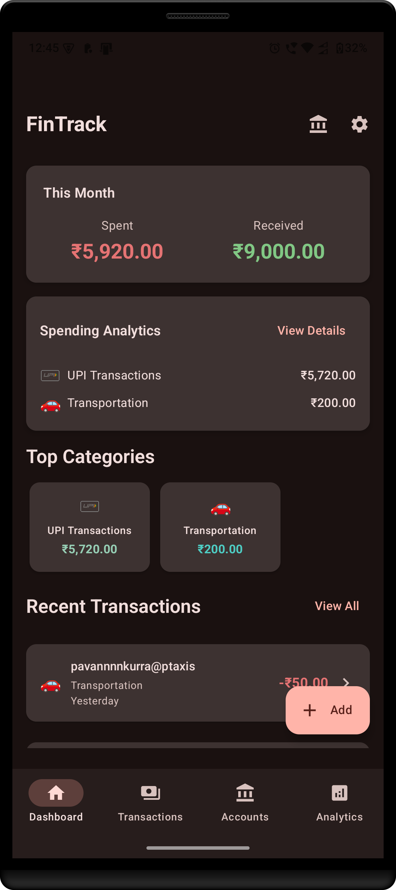
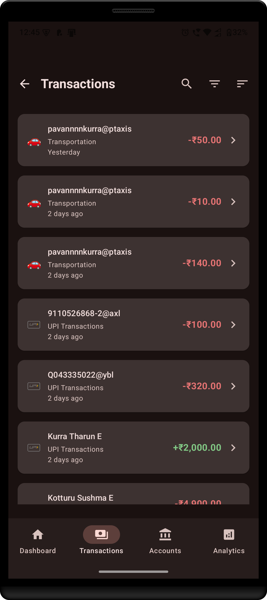
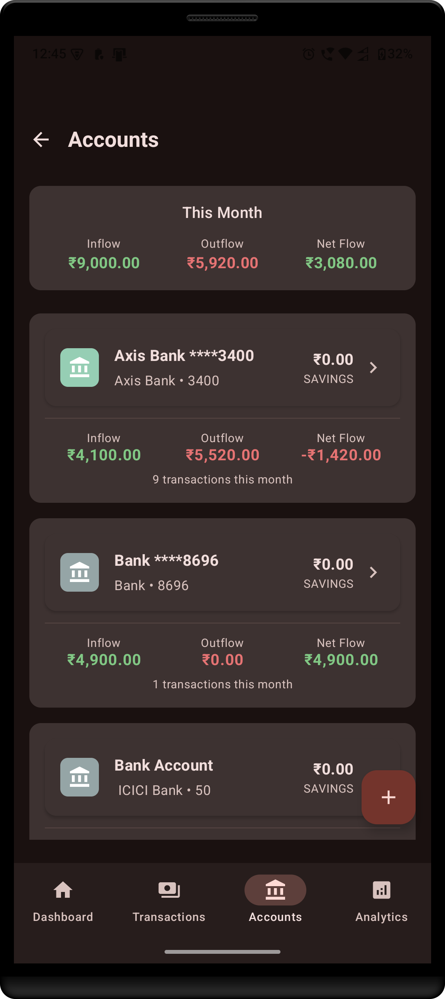
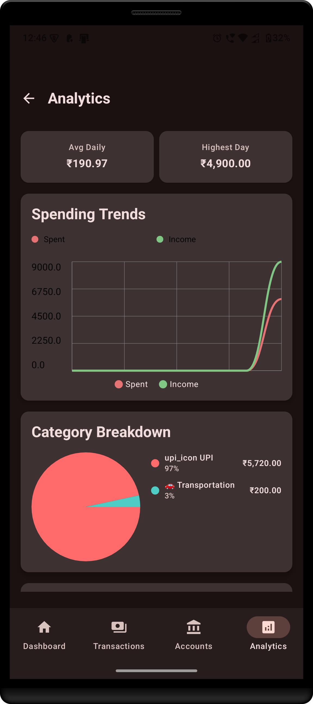

FinDashboard
=============

Project: FinDashboard (Android)

Overview
--------
FinDashboard is an Android personal finance app that displays transactions, allows filtering (category, date range, min/max amount, type), searching, and sorting. The app stores transaction data locally and uses a repository/DAO architecture for data access. This README documents project specs, how to build/run/test, filtering/sorting behavior, debugging and logging guidance, privacy/security notes, and contribution information.

Key features
------------
- Transaction list with search
- Filtering by categories, transaction type (debit/credit), date range, min/max amount
- In-memory sorting (after filtering) by amount or date (recommended optimization)
- Offline-first / local storage via Room (DAO + Repository layers)
- Simple, modular architecture (UI → ViewModel → Service/Repository → DAO → DB)

Architecture overview
---------------------
Modules and important packages:
- app/: Android application module (Gradle project)
- app/src/main/java/com/kpr/fintrack/presentation/: UI layer (screens, bottom sheets)
  - transactions/: Transaction screen and ViewModel (see `TransactionsViewModel.kt`)
- app/src/main/java/com/kpr/fintrack/data/: Data layer (repositories, DAO, Room database)
  - database/: Room database and DAOs (e.g., `TransactionDao`)
  - repository/: `TransactionRepository` implementation
- app/src/main/java/com/kpr/fintrack/domain/: Domain models and repository interfaces

Data flow (typical)
- UI (Transaction screen) sends user actions to `TransactionsViewModel`.
- ViewModel composes flows from repository methods and exposes a `uiState`.
- Repository queries the `TransactionDao` to fetch transactions (filtered SQL queries) or all transactions.
- After filtering is applied and results received, sorting should be applied in-memory (ViewModel) to avoid hitting the database repeatedly.

Requirements
------------
- JDK 11+ (Android Gradle plugin compatible)
- Android SDK with required platforms and build tools
- Gradle (wrapper included)
- Android Studio recommended for development

Build & run (Windows / cmd.exe)
-------------------------------
Open a Windows command prompt (cmd.exe) at the project root (where `gradlew.bat` is located) and run:

```bat
:: Build debug APK
gradlew.bat assembleDebug

:: Install & run on a connected device or emulator
gradlew.bat installDebug
```

Alternatively, open the project in Android Studio and run from the IDE.

Tests
-----
- Unit tests: run `gradlew.bat test` from the project root.
- Android instrumentation tests: run `gradlew.bat connectedAndroidTest` (device/emulator required).

Filtering behaviour and notes
----------------------------
- Filters are represented by `TransactionFilter` (see domain repository). Typical fields:
  - categoryIds: List<Long>?
  - startDate / endDate: Long? (epoch millis)
  - minAmount / maxAmount: Long? (or numeric value consistent with domain model)
  - isDebit: Boolean?
  - searchQuery: String?

- The app previously had a bug where the max amount filter did not exclude transactions with amount greater than the specified max. That issue typically stems from one of the following:
  1. Unit mismatch (e.g., amount stored in cents but max amount entered as whole currency units). Make sure both sides are in the same unit.
  2. Incorrect SQL/comparison operator in the DAO (e.g., using > instead of <=). Check the DAO query that applies min/max.
  3. Null-check logic that ignores max when combined with other conditions.

- Logging has been added to the filter application steps (Logcat tags used in the project include `FilterBottomSheet`, `TransactionDao`, and `TransactionsViewModel`) so you can view the exact parameters applied when filtering.

Recommended in-memory sorting (optimisation)
-------------------------------------------
To avoid hitting the database for every sort option change, follow this approach:

1. Apply filters and fetch the filtered transaction list once (either via repository/DAO or by caching the last fetched list in ViewModel).
2. Store the filtered list in the `TransactionsViewModel` (or in `uiState`).
3. When the user selects a sort option (by amount or by date), perform an in-memory sort on the cached list and update the UI state.

Advantages:
- Fast UI responsiveness; no repeated database/IO calls for sorting.
- Sorting is stable and can be combined with client-side pagination or grouping.

Developer notes / Suggested API
- `TransactionsViewModel` should expose:
  - a `uiState` StateFlow with the current filtered list (and optionally the cached unsorted list)
  - `applyFilter(filter: TransactionFilter)` to update filters and fetch results
  - `applySort(sortType: SortType)` which sorts the already-fetched list in-memory and updates `uiState`

- `SortType` enum suggestion:
  - BY_AMOUNT_ASC, BY_AMOUNT_DESC, BY_DATE_ASC, BY_DATE_DESC

- Implementation outline for `applySort` (pseudocode):
  - if cachedFilteredList is empty: return
  - when BY_AMOUNT_ASC: cachedFilteredList.sortedBy { it.amount }
  - when BY_AMOUNT_DESC: cachedFilteredList.sortedByDescending { it.amount }
  - update uiState with sorted list

Debugging & Logging
-------------------
- Useful Logcat tags present in the project:
  - `FilterBottomSheet` — logs when user applies filters and the filter values
  - `TransactionDao` — logs SQL query parameters when querying the DB
  - `TransactionsViewModel` — ViewModel lifecycle and state logs

- Common troubleshooting steps:
  1. Reproduce a failing filter in the app.
  2. Open Logcat in Android Studio and filter by the tags above.
  3. Verify the filter parameters (min/max, dates, categories) shown in logs.
  4. Verify amount units (cents vs currency units) in logs and database.
  5. If SQL parameters look correct, inspect the DAO query to ensure the comparison operators are correct (<= for max, >= for min).

Privacy & security
------------------
- Data storage: Transaction data is stored locally on the device using Room DB. No remote transmission is performed by default.
- No analytics, crash reporting, or third-party telemetry is enabled unless explicitly configured by developers.
- Sensitive information: The app does not collect PII by default. If you add integrations (analytics, backups, cloud sync), make sure to document and provide opt-in flows.
- Recommendations:
  - Do not hardcode API keys or secrets into source code.
  - Use Android Keystore for encryption if storing highly sensitive data.

Contribution guide
------------------
- Follow existing project style and package structure.
- Run existing tests and ensure new changes include unit tests where possible.
- When making behavioral changes (filtering/sorting), add unit tests to cover edge cases (null bounds, currency unit mismatches, empty lists).

Where to look for filter/sort related code
-----------------------------------------
- `app/src/main/java/com/kpr/fintrack/presentation/ui/transactions/TransactionsViewModel.kt` — ViewModel logic for composing filtered transactions
- `app/src/main/java/com/kpr/fintrack/data/database/TransactionDao` — DAO where SQL queries and parameter binding happens
- UI components: Filter Bottom Sheet and Transaction screen under `presentation/ui/transactions`

Contact / Maintainers
---------------------
Please open issues or PRs in the repository with clear descriptions, steps to reproduce, and logs when applicable.

License
-------
Add project license here (e.g., MIT) or provide license file at the project root.

Change log
----------
- 2025-10-18: Created README with project overview, build/run instructions, filter/sort guidance, debugging and privacy notes.

Screenshots
-----------
Below are example screenshots you can include to showcase the app UI. Place the image files in the `docs/screenshots/` folder (recommended). Use the following file names so they match the links below:

- `docs/screenshots/Dashboard.svg` — Dashboard screen
- `docs/screenshots/Transactions-Screen.svg` — Transactions screen
- `docs/screenshots/Accounts-Screen.svg` — Accounts screen
- `docs/screenshots/Analytics-Screen.svg` — Analytics screen

Add images to the repo and they will appear below automatically.

<!-- Screenshots -->

<div style="text-align:center">
  
  
</div>

<div style="text-align:center; margin-top:12px;">
  
  
</div>


